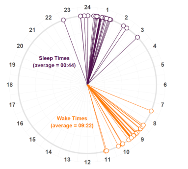

# Using color and shapes to visualise circadian timing

## Background

Wrist-worn sensors allow physical activity, sleep and circadian rhythms to be monitored unobtrusively over long time periods, and can reveal patterns that cannot be detected in datasets collected over days. These plots aim to convey information on the timing of sleep and wake time using colors and shapes.

 Sleep Bubbles
 Sleep Clocks
 
 
##  Methods
All plots made using ggplot and actigraphy data at 1 minute intervals.

## Sleep Bubbles
[Plot](Images/clock.png)
[Code](Code/bedtime_plot.R)  

Sleep clocks show the times of sleep and wake times using a 24h clock face.  The spread of the clock "hands" illustrates the variation and the mean is labelled, and shown as a single, darker colored hand.  

[Code for sleep clock](/code/sleep_clocks.R)  
[Sample Plotting a sleep spiral in segments or tiles](/analysis/Spirals_plotting.R)          
              
The One Year of Actigraphy (OYA) project data are curated by the National Sleep Research Resource, an NHLBI-supported repository for sharing sleep and circadian data. The data are wrist actigraphy recordings of a 62 year old male using a MotionWatch8 (CamNtech Ltd) system on the non-dominant wrist between June 2016 and June 2017.  Data are activity units derviced from the Motionwatch8 sampled at 1Hz. The R package ggplot2 was used to construct an actigram of activity against time with the level of activity was shown by a diverging colour gradient using the viridis package. 

## Citations and Acknowledgement
Zhang GQ, Cui L, Mueller R, Tao S, Kim M, Rueschman M, Mariani S, Mobley D, Redline S. The National Sleep Research Resource: towards a sleep data commons. J Am Med Inform Assoc. 2018 Oct 1;25(10):1351-1358. doi: 10.1093/jamia/ocy064. PMID: 29860441; PMCID: PMC6188513.

Actigraphy Analysis Project: Predictive algorithms of individual wrist actigraphy for real life. (http://www.actigraphy.eu/actigraphy-analysis-project.html)

Delucca, gianluigi. 2021. "Motionwatch8 Wrist Actimetry Data Analysis: From Ambulatory Recording to Real Life Monitoring." OSF Preprints. May 13. doi:10.31219/osf.io/pdctj.

Gianluigi G. Delucca. 2022. “ Motionwatch8 Wrist Activity and Light Analysis: from ambulatory recording toward real life monitoring.” OSF Preprints. June 24. doi.org/10.31219/osf.io/cdqxh.

The National Sleep Research Resource was supported by the National Heart, Lung, and Blood Institute (R24 HL114473, 75N92019R002).

## R-code  

[Processing and cleaning accelerometery raw data](/analysis/Spirals_data_cleaning.R)  

[Plotting a sleep spiral in segments or tiles](/analysis/Spirals_plotting.R)  

[Batch plotting sprials](https://github.com/cawyse9/Sleep-Spirals/blob/main/analysis/Spirals_batch%20plot.R)  
